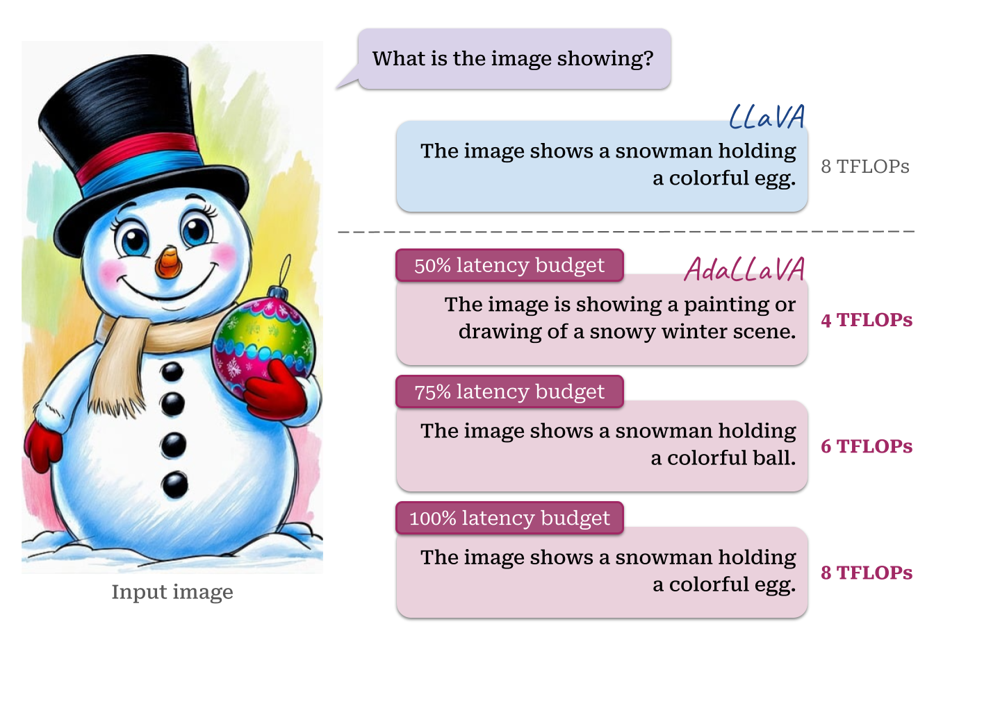

# AdaLLaVA: Learning to Inference Adaptively for Multimodal Large Language Models

<span style="color: red;">This is a draft version of our official code repo, will move to [here](https://github.com/zhuoyan-xu/AdaLLaVA) in the end.</span>

*Learning to Inference Adaptively for Multimodal Large Language Models*

[Zhuoyan Xu*](https://pages.cs.wisc.edu/~zxu444/home/), [Khoi Duc Nguye*](https://khoiucd.github.io/), Preeti Mukherjee, [Somali Chaterji](https://schaterji.io/), [Saurabh Bagchi ](https://www.saurabhbagchi.us/), [Yingyu Liang](https://pages.cs.wisc.edu/~yliang/), [Yin Li](https://www.biostat.wisc.edu/~yli/)


[[Paper]()] [[Project Page](https://zhuoyan-xu.github.io/ada-llava/)] [[Model Zoo](./docs/MODEL_ZOO.md)]




## TODO List
- [ ] Upload the model weights to Hugging Face
    - [x] AdaLLaVA-L: 7b, 13b
    - [ ] AdaLLaVA-H: 7b
    - [ ] AdaLLaVA-prumerge-L: 7b, 13b
    - [ ] AdaLLaVA-prumerge-H: 7b
    - [ ] AdaLLaVA-prumerge-plus-L: 7b
- [ ] The code for model training
- [ ] The code for model inference
- [ ] The code for evaluation with FLOPs reporting
- [ ] (Optional) Make the Table-LLaVA checkpoints compatible with the Transformers package (loadable via LlavaForConditionalGeneration.from_pretrained(''))

## Release
- [12/12/2024] 🔥 We released **AdaLLaVA**. We propose a dynamic inference approach for multimodal Large Language Models that operates efficiently under resource constraints.  Checkout our [paper](https://arxiv.org/abs/xx).

[](https://github.com/tatsu-lab/stanford_alpaca/blob/main/LICENSE)
**Usage and License Notices**: This project utilizes certain datasets and checkpoints that are subject to their respective original licenses. Users must comply with all terms and conditions of these original licenses, including but not limited to the [OpenAI Terms of Use](https://openai.com/policies/terms-of-use) for the dataset and the specific licenses for base language models for checkpoints trained using the dataset (e.g. [Llama community license](https://ai.meta.com/llama/license/) for LLaMA-2 and Vicuna-v1.5). This project does not impose any additional constraints beyond those stipulated in the original licenses. Furthermore, users are reminded to ensure that their use of the dataset and checkpoints is in compliance with all applicable laws and regulations.


## Contents
- [Setup](#setup)
- [AdaLLaVA Weights](#adallava-weights)
- [Model Zoo](docs/MODEL_ZOO.md)
- [Dataset](#dataset)
- [Train](#train)
- [Evaluation](#evaluation)


## Setup

1. Clone this repository and navigate to LLaVA folder
```bash
git clone https://github.com/zhuoyan-xu/test-adallava.git
cd AdaLLaVA
```
2. Install Package

```bash
conda create -n test-adallava python=3.10
conda activate test-adallava
cd src
bash install.sh

export PYTHONPATH=$PYTHONPATH:src
```

### Quick Start With HuggingFace

<details>
<summary>Example Code</summary>

```Python
from libs.model.builder import load_pretrained_model

from pdb import set_trace as pds
model_path = "zhuoyanxu/ada-llava-v1.5-7b"
model_name = "ada_llava_llama"

tokenizer, model, image_processor, context_len = load_pretrained_model(
    model_path=model_path,
    model_base=None,
    model_name=model_name,
    latency=15
)
```
where latency denotes the number of layers we kept from half of the layers. 
Check out the details wth the `load_pretrained_model` function in `libs/model/builder.py`.

You can also use the `eval_model` function in `libs/eval/run_llava.py` to get the output easily. By doing so, you can use this code on Colab directly after downloading this repository.

``` python
import os
os.environ["CUDA_VISIBLE_DEVICES"] = "0"

from libs.eval.run_llava import eval_model

model_path = "zhuoyanxu/ada-llava-v1.5-7b"
model_name = 'ada_llava_llama'

prompt = "What is the image showing?"
image_file = "docs/snowman.jpg"

args = type('Args', (), {
    "model_path": model_path,
    "model_base": None,
    "model_name": model_name,
    "query": prompt,
    "conv_mode": None,
    "image_file": image_file,
    "sep": ",",
    "temperature": 0,
    "top_p": None,
    "num_beams": 1,
    "max_new_tokens": 512,
    "latency": 15
})()

eval_model(args)
```
</details>


## AdaLLaVA Weights
Please check out our [Model Zoo](docs/MODEL_ZOO.md) for all public AdaLLaVA checkpoints, and the instructions of how to use the weights.

## Dataset
We follow original LLaVA repository and use their *stage-2:Visual Instruction Tuning* [data](https://github.com/haotian-liu/LLaVA/blob/main/docs/Data.md). See details for prepare dataset in [Train](#train).

## Training


### Prepare data
Follow instructions from [here](https://github.com/haotian-liu/LLaVA?tab=readme-ov-file#visual-instruction-tuning) to download images from these 5 datasets for LLaVA v1.5 fine-tuning. Put the zip files in the corresponding folders and unzip them. 
image path:
```bash
├── coco
│   └── train2017
├── gqa
│   └── images
├── ocr_vqa
│   └── images
├── textvqa
│   └── train_images
└── vg
    ├── VG_100K
    └── VG_100K_2
```
download instruction tuning data from [here](https://huggingface.co/datasets/liuhaotian/LLaVA-Instruct-150K/blob/main/llava_v1_5_mix665k.json) into `./playground/data/LLaVA-Instruct-150K/llava_v1_5_mix665k.json`.

### Joint training of model and scheduler
Our training directly follow original LLaVA repository *stage-2:Visual Instruction Tuning*.  We load pretrained checkpoint of llava 1.5 and random initilize weights for scheduler.


Training script with DeepSpeed ZeRO-3: [`train_script.sh`](./scripts/train_script.sh).  Set the ```model_name_or_path``` parameter to the path of your pre-trained llava checkpoints, such as ```liuhaotian/llava-v1.5-7b```. The trained table llava model will be saved at the specified ```output_dir```.


## Evaluation

We use the same benchmark as LLaVA-1.5. We use popular [lmms-eval](https://github.com/EvolvingLMMs-Lab/lmms-eval) for evaluating llava model on wide range of benchmarks. We use [LLM-Viewer](https://github.com/hahnyuan/LLM-Viewer) for computing FLOPs.

For basic LLaVA-1.5 performance, see [Evaluation.md](./src/LLaVA/docs/Evaluation.md).

For AdaLLaVA performance under different latency budget with FLOPs computed, see [FLOPs_Eval.md](./docs/FLOPs_Eval.md)


## Citation

If you find **AdaLLaVA** useful for your research and applications, please cite using this BibTeX:
```bibtex

```


## Acknowledgement


- [LLaVA](https://github.com/haotian-liu/LLaVA): The codebase we built upon.

- [LLM-Viewer](https://github.com/hahnyuan/LLM-Viewer): The code we used for calculating FLOPs and prefill time.

- [lmms-eval](https://github.com/EvolvingLMMs-Lab/lmms-eval): The code for evaluating multimodal LLMs.

